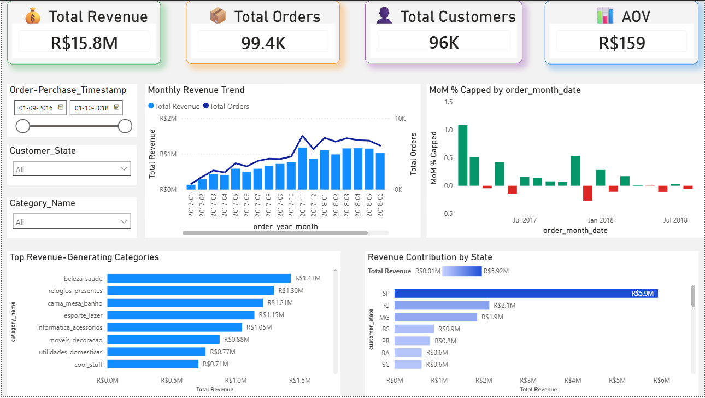
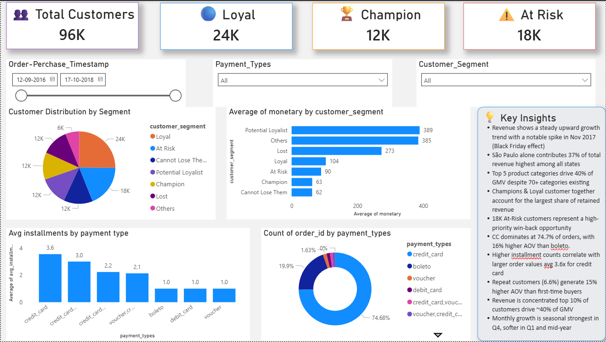
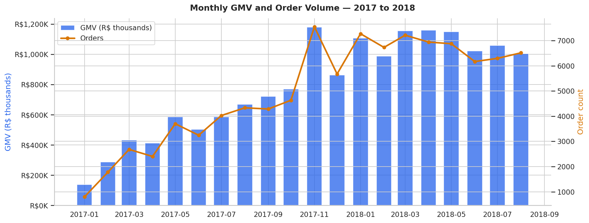
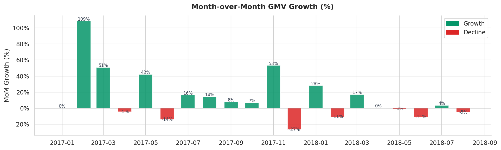
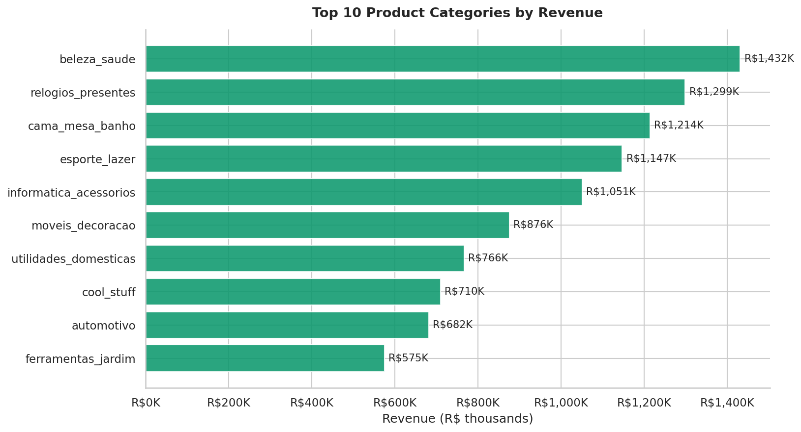
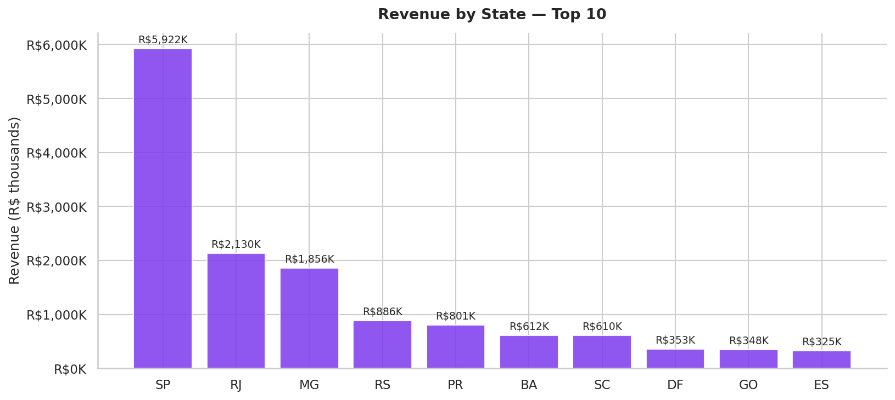
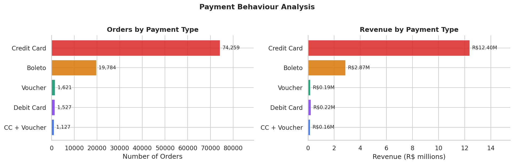
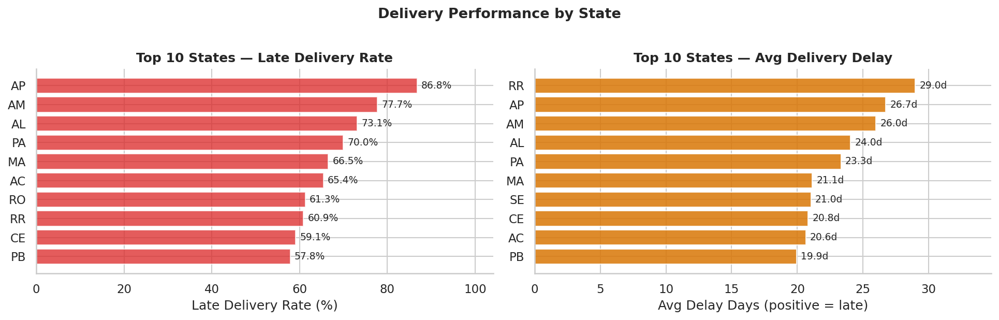
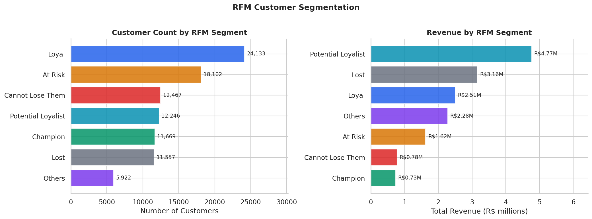
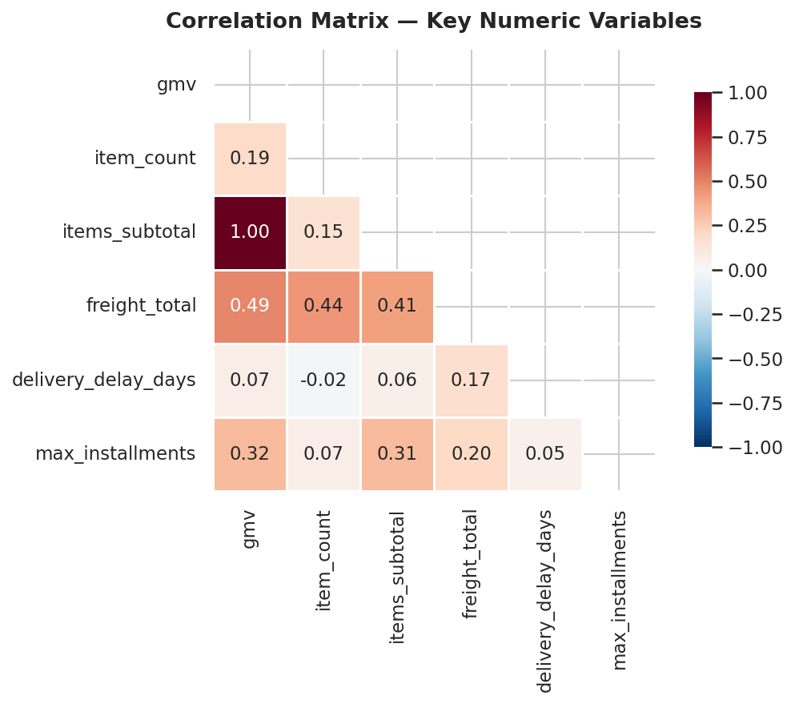

# 🛒 Olist E-Commerce Sales & Customer Behavior Analysis

> **End-to-end data analyst project** — SQL (DBeaver) · Python EDA · Power BI  
> Dataset: [Olist Brazilian E-Commerce](https://www.kaggle.com/datasets/olistbr/brazilian-ecommerce) — 99,441 orders · Sep 2016 – Oct 2018

---

## 📌 Business Problem

Olist is a Brazilian e-commerce marketplace connecting small businesses to customers across the country. This project answers 4 core business questions:

- How is revenue trending and what drives growth peaks?
- Which product categories and states generate the most GMV?
- Who are the best customers and who is at risk of churning?
- Is delivery performance meeting expectations — and where is it failing?

---

## 🧰 Tools & Technologies

| Tool | Purpose |
|---|---|
| **SQL · SQLite via DBeaver** | Data cleaning, table creation, KPI queries, RFM segmentation |
| **Python · pandas · matplotlib · seaborn** | Exploratory data analysis, 8 charts |
| **Google Colab** | Notebook execution |
| **Power BI** | Interactive 2-page dashboard |

---

## 📂 Project Structure

```
olist-ecommerce-analysis/
│
├── sql/
│   ├── 01_cleaning_and_tables.sql   ← Master table creation + 7 analytical tables
│   └── 02_business_analysis.sql     ← Business KPI queries + segmentation
│
├── notebooks/
│   ├── eda.ipynb                    ← Full EDA notebook (8 charts)
│   └── charts/
│       ├── 01_monthly_gmv.png
│       ├── 02_mom_growth.png
│       ├── 03_top_categories.png
│       ├── 04_revenue_by_state.png
│       ├── 05_payment_analysis.png
│       ├── 06_delivery.png
│       ├── 07_rfm_segments.png
│       └── 08_correlation.png
│
├── dashboard_page1.png              ← Power BI Page 1 — Sales Overview
├── dashboard_page2.png              ← Power BI Page 2 — Customer & Behavior
└── README.md
```

---

## 📊 Dashboard Preview

### Page 1 — Sales Overview


### Page 2 — Customer & Behavior


---

## 📈 EDA Charts

### Monthly GMV & Order Volume


### Month-over-Month Growth


### Top 10 Product Categories


### Revenue by State


### Payment Analysis


### Delivery Performance by State


### RFM Customer Segmentation


### Correlation Matrix


---

## 🔍 Key Findings

### Revenue & Growth
| Metric | Value |
|---|---|
| Total GMV | **R$ 15.84M** |
| Total orders | **99,441** |
| Average order value | **R$ 159.33** |
| Peak month | **Nov 2017 — R$ 1.18M** (Black Friday) |
| Months with positive MoM growth | **12 out of 19** |

### Product Categories
- Top 5 categories drive **38.8% of total GMV** despite 70+ categories existing
- **Health & Beauty** is #1 with R$ 1.43M revenue
- **Watches & Gifts** has the highest avg order value at R$ 389

### Geography
- **São Paulo = 37.4% of total GMV** — R$ 5.9M
- **SP + RJ + MG = 62.5% of GMV** — highly concentrated in southeast Brazil
- Remote northern states have severely underperforming delivery

### Delivery Performance
| Metric | Value |
|---|---|
| Overall late delivery rate | **23.3%** |
| Best state (SP) | **9.3% late** |
| Worst state (AP) | **86.8% late** |

### Payment Behaviour
- Credit card dominates at **74.7% of orders**
- Credit card AOV: **R$ 166.95** vs Boleto: **R$ 145.03** — 15% higher

### Customer Segmentation (RFM)
| Segment | Customers | Total Revenue | Avg Spend |
|---|---|---|---|
| Loyal | 24,133 | R$ 2.51M | R$ 104 |
| At Risk | 18,102 | R$ 1.62M | R$ 90 |
| Potential Loyalist | 12,246 | **R$ 4.77M** | **R$ 389** |
| Champion | 11,669 | R$ 0.73M | R$ 63 |
| Lost | 11,557 | R$ 3.16M | R$ 273 |

> **Key insight:** Potential Loyalists (12K customers) generate 6.5× more revenue than Champions (11K customers) despite similar group sizes — they make rare but very high-value purchases, requiring a completely different retention strategy.

---

## 🧠 SQL Techniques Used

- `WITH` CTEs for layered, readable query logic
- `LAG()` window function for month-over-month growth
- `SUM() OVER()` for cumulative GMV running total
- `NTILE(4)` for RFM quartile scoring
- `RANK()` for within-year performance ranking
- Multi-table `JOIN` across 5 normalized tables
- Subquery aggregation before joining (payments, order items)
- `CASE WHEN` for customer segmentation and state classification
- Correlated subqueries for Pareto and quadrant analysis

---

## 💡 Business Recommendations

1. **Launch planned Black Friday campaign** — Nov 2017 shows a natural R$ 1.18M spike. A structured promotional push could amplify this significantly
2. **Win-back the 18K At-Risk customers** — targeted email campaign with discount before they move to Lost segment
3. **Upsell Potential Loyalists** — highest spend segment (R$ 389 avg). Priority for premium product recommendations
4. **Fix northern state logistics** — AP, AM, RR have 70–87% late rates. Partner with regional couriers to protect satisfaction
5. **Promote credit card installments** — 15% higher AOV than boleto; incentivising installment plans could grow basket size

---

## 🚀 How to Reproduce

```bash
# 1. Download the Olist dataset from Kaggle
#    https://www.kaggle.com/datasets/olistbr/brazilian-ecommerce

# 2. Open sql/01_cleaning_and_tables.sql in DBeaver
#    Run all statements to create the 7 analytical tables

# 3. Open sql/02_business_analysis.sql for KPI queries

# 4. Run notebooks/eda.ipynb in Google Colab
#    Upload the exported CSVs and run all cells

# 5. Open Power BI Desktop
#    Import the exported CSVs to recreate the dashboard
```

---

## 📬 Connect

**Abhinandan Sonne** — Data Analyst | SQL · Python · Power BI  
[LinkedIn](https://www.linkedin.com/in/abhinandan-sonne-b979431a4) · [GitHub](https://github.com/Abhisonne)
